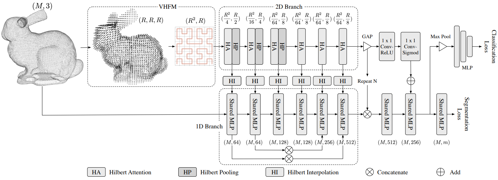

# Efficient Point Cloud Analysis Using Hilbert Curve

 The source code of our work **"Efficient Point Cloud Analysis Using Hilbert Curve"**

### Requirements
- PyTorch >= 1.6 
- pandas
- numpy
- [spconv](https://github.com/traveller59/spconv) (tested with spconv==1.2.1 and cuda==10.2)

## Data Preparation
Download and unzip the data into `data/` directory

## Training
1. train the network by running `sh train.sh`

## Testing
1. test the pretrained by running `sh test.sh`

## Acknowledgments
We thanks for the opensource codebases, [PointNet](https://github.com/yanx27/Pointnet_Pointnet2_pytorch), [SO-Net](https://github.com/lijx10/SO-Net.git) and [spconv](https://github.com/traveller59/spconv)