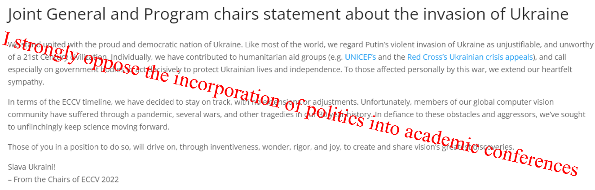

## Personal Statement
I strongly disagree with the following statement from ECCV committee.

Where were you when the people of Afghanistan and Iraq suffered from the invasion and slaughter of American troop? Why only stand with Ukraine, not Afghanistan or Iraq?

**I don't want ECCV becomes political propaganda machine of the western world.**
